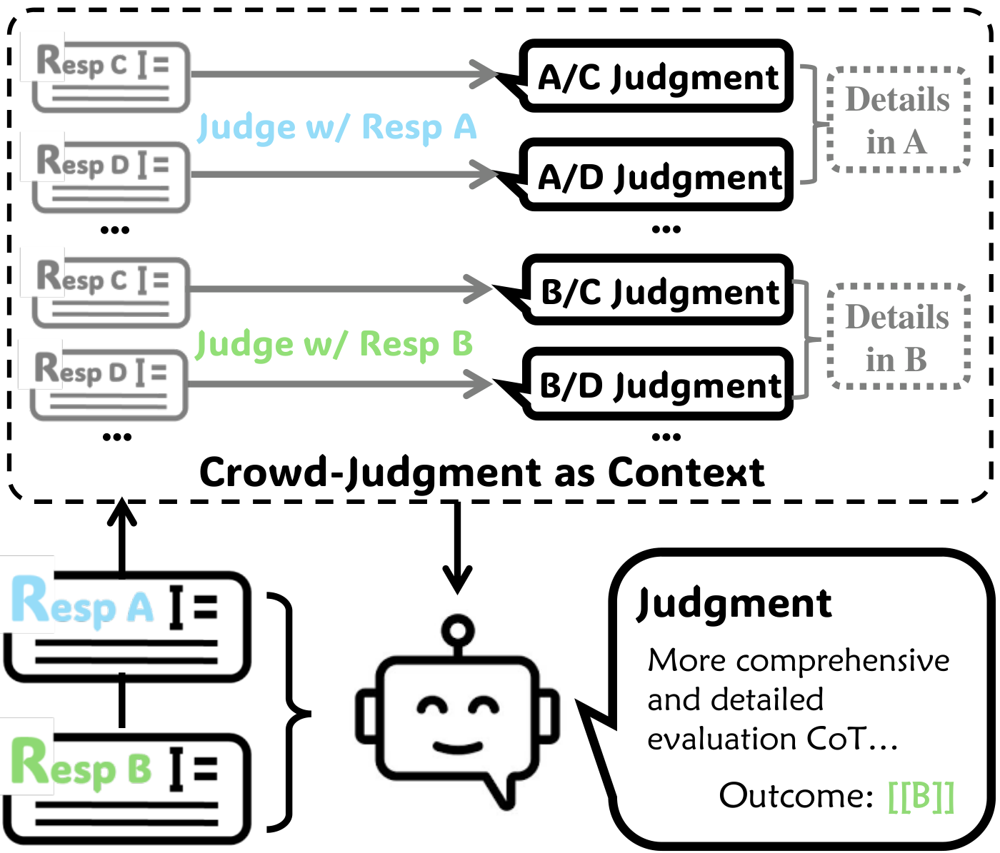

# Crowd Comparative Reasoning: Unlocking Comprehensive Evaluations for LLM-as-a-Judge
<!-- Example: Test-Time Scaling Atlas: A Unified Framework for Inference-Time Reasoning in LLMs -->


<div align="center">
  
  <p><b>Figure 1:</b> Summary of the Crowd-based Comparative Evaluation.</p>
</div>

**Crowd-based Comparative Evaluation** is a test-time scaling strategy for LLM-as-a-Judge. It supports introducing additional crowd responses to compare with the candidate responses, thereby exposing deeper and more comprehensive details within the candidate responses. Our approach is inspired by human evaluative behavior: humans merely compare candidates in isolation by also contrasting them against a broader crowd, thereby uncovering additional nuanced insights about each candidate.

## 📢 News and Updates

- **[Feb 2025]** 📌 Our initial paper is on [**Arxiv**](https://arxiv.org/abs/2502.12501v1)!

---

## 📘 Overview

<!-- Add 1-3 key diagrams or tables summarizing your project -->

 

<p align="center"><b>Figure 1:</b> Pipeline of the Crowd-based Comparative Evaluation.</p>

 

<p align="center"><b>Figure 1:</b> Evaluation performance under scaling crowd judgments in the context. As the number of crowd judgments grows, both accuracy and CoT length generally increase.</p>


There are more detailed results in our paper~


---

## 🚀 How to Use

### 📦 Installation

1. Clone the repository and navigate to the project folder:

```bash
git clone https://github.com/Don-Joey/CCE.git
cd CCE
```

2. Create the environment and install dependencies:
   
```bash
conda create -n cce python=3.10 -y
conda activate cce
pip install --upgrade pip
pip install -r requirements.txt
```

### ⚡ Quick Start

Firstly, users download our prepared crowd responses and judgments in folder ``results''.

Evaluate **CCE** on the RewardBench. Notably, we provide a quick start section to directly run the core part in our framework, where we skip the crowd responses generation and crowd judgments generation stages. You can replace your generated crowd judgments to ours.

```bash
## Our generated crowd judgments are in ``results/rewardbench_mtbench_PoolModified_gpt-4o.json''
## You should fill your api-key.
run MAIN.ipynb
```

In main.ipynb, we provide the *criticizing selection/outcome removal part*, *crowd-judgment as context in prompt part*, and *evaluating CCE part*.

### 🔍 Whole Pipeline

1. **Generate Crowd-Responses**: At this stage, you can use any LLM of your choice to generate the corresponding crowd responses for the prompts in the benchmark.
    
2. **Generate Crowd-Judgments**: At this stage,

```bash
## if you want to compare crowd response to response B,
python main.py [benchmarkname: e.g.,rewardbench] [judgd prompt, e.g.,mtbench] [crowd judgment model name: e.g.,qwen-2.5-3b-instruct],default [base judge model: e.g.,gpt-4o] False True False

## if you want to compare crowd response to response A,
python main.py [benchmarkname: e.g.,rewardbench] [judgd prompt, e.g.,mtbench] default,[crowd judgment model name: e.g.,qwen-2.5-3b-instruct] [base judge model: e.g.,gpt-4o] False True False
```

## 📌 Coming Soon

- [ ] Support for whole pipeline generation
- [ ] Compare to other test-time scaling for LLM-as-a-Judge/Generative RM.

## 📄 Citation

```bibtex
@inprocedings{zhang2025crowdcomparativereasoningunlocking,
    title={Crowd Comparative Reasoning: Unlocking Comprehensive Evaluations for LLM-as-a-Judge}, 
    author={Qiyuan Zhang and Yufei Wang and Yuxin Jiang and Liangyou Li and Chuhan Wu and Yasheng Wang and Xin Jiang and Lifeng Shang and Ruiming Tang and Fuyuan Lyu and Chen Ma},
    year={2025},
    eprint={2502.12501},
    booktitle={arXiv},
}
···

